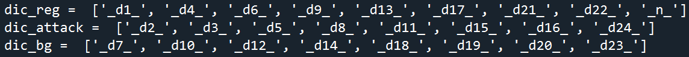
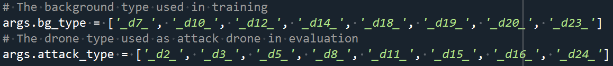

# Drone Authentication via Acoustic Fingerprint
The following content/function will be added：
- [x] Basic tutorial about this project.
- [x] Platform specification.
- [x] Package requirements.
- [x] Link of drone audio dataset.
- [ ] Add the plot function.
- [ ] Improve the use of config files. Use relative paths and be more centralized.
- [ ] Add a progress bar in training for indication.
- [ ] Use command line arguments to control the training and evaluation process.

This repository contains the code for the paper [Drone Authentication via Acoustic Fingerprint]().

# Dataset
Please download the dataset through the following link: [dataset](http://dx.doi.org/10.5525/gla.researchdata.1348).

# Requirements
The platform is Window 10. (Ubuntu 20.04 may be fine.)

Please install Anaconda at first. If you do not have Anaconda, please see the following [link](https://www.anaconda.com/products/distribution#Downloads).

Then create a new environment: `conda env create -f environment.yml` 

You need about 80G of storage space to generate the PKL dataset and trained models.

# Audio Dataset Explanation
- **DS1:** this dataset contained drone audio from No. 1 - No. 8.
- **DS2:** this dataset contained drone audio from No. 1 - No. 24.
- **DS1N:** we added AWGN to **DS1** with 0 dB SNR to create **DS1N**. The lengths of the corresponding drone audio in **DS1N** and **DS1** are equal to each other.
- **DS2N:** we added AWGN to **DS2** with 93 levels of SNR ranging from -8.00 dB to 15.00 dB with a step of 0.25 dB to create **DS2N**. The size of **DS2N** is 93 times larger than the size of **DS2**. In other words, each level of SNR creates a new subset in **DS2N**, whose size is equal to **DS2**.

# Folder Description
## dataset_build
Build MFCC dataset based on collected drone audio. The format of the generated dataset is ".pkl".
## experiment
The code of all experiments, which are mentioned in the paper.
## runners
These files help with the training and evaluation process.
## toolbox
Some modules can be used in different programs.

# Explaination of Config files
- `originData_path`: The root of all drone audio.
- `output_path`: Where to output/obtain the model.
- `csv_savePath`: Where to save the evaluation results.
- `pkl_savePath`: Where to save the dataset of extracted MFCC features.

# At the Beginning
Download the drone audio dataset, then change all `originData_path` in all config files to the root of download drone audio.

# Experiment of Frame Length Change
1. Run `./dataset_build/pkl_gen_timeVar.py` to generate the dataset in `.pkl` format. This dataset is created from **DS1**.
   - Default dataset storage path is `./pkl_dataset/1_timeVar`.
2. Run `./experiment/timeVar/train_all_model.py` to train 8 different ML models on all generated datasets.
   - Default model storage path is `./trained_model/1_timeVar`.
3. Run `./experiment/timeVar/eval_all_model.py` to obtain the accuracy of each model on test set.
   - Default csv storage path is `./result/1_timeVar`.

# Filter-varying Experiment
## Overview
There are 9 config files for training different models.
- `config_filterVar_1_oneThird`
- `config_filterVar_1_twoThirds`
- `config_filterVar_1_all`
- `config_filterVar_2_oneThird`
- `config_filterVar_2_twoThirds`
- `config_filterVar_2_all`
- `config_filterVar_3_oneThird`
- `config_filterVar_3_twoThirds`
- `config_filterVar_3_all`
## PKL Generation
1. Run `./dataset_build/pkl_gen_filterVar.py` to generate the dataset in `.pkl` format. This dataset is created from **DS1**.
## Training and Evaluation
1. Change the name of config file in line 90 of `./experiment/filterVar/train_all_model_filterVar.py` to train different models.
2. Change the name of config file in line 104 of `./experiment/filterVar/eval_all_model_filterVar.py` to evaluate different models.
3. Run `./experiment/filterVar/train_all_model_filterVar.py`.
   - Default model storage path is `./trained_model/2_filterVar/8d_x_xxxx`.
4. Run `./experiment/filterVar/eval_all_model_filterVar.py`.
   - Default csv storage path is `./result/2_filterVar/8d_x_xxxx`.

# Filter-varying Experiment with AWGN
## PKL Generation
1. Run `./dataset_build/pkl_gen_filterVar_noise.py` to generate the dataset in `.pkl` format. This dataset is created from **DS1N**.
## Evaluation
1. Change the name of config file in line 107 of `./experiment/filterVar/eval_all_model_filterVar_noise.py` to evaluate different models.
2. Run `./experiment/filterVar/eval_all_model_filterVar_noise.py`.
   - Default csv storage path is `./result/3_filterVar_noise/8d_x_xxxx`.

# Authentication of 24 drones without AWGN
This experiment are conducted on **DS2**.
## Training and Evaluation
1. Run `./experiment/noiseVar/train_all_model_noNoise.py`.
   - Default model storage path is `./trained_model/4_noiseVar/noNoise`.
2. Run `./experiment/noiseVar/eval_all_model_noNoise.py`.
   - The results will be shown in the console.

# Authentication of 24 drones with AWGN
This experiment are conducted on **DS2N**.
## PKL Generation
1. Run `./dataset_build/pkl_gen_noiseVar.py` to generate the dataset in `.pkl` format. This dataset is created from **DS2N**.
## Evaluation
1. Run `./experiment/noiseVar/eval_all_model_noiseVar.py`.
   - Default csv storage path is `./result/4_noiseVar`.

# Security Study (Attack)
1. Run `./dataset_build/pkl_gen_base.py` to generate the dataset in `.pkl` format. This dataset is created from **DS2**.
2. Run `./experiment/attack/train_attack.py`.
3. Record `dic_reg`, `dic_attack`, `dic_bg` shown in console.
   - For example
   
4. Change the value of `args.bg_type` and `args.attack_type` in `./experiment/attack/evaluate_attack.py` to `dic_bg` and `dic_attack`, respectively.
   - For example
   
5. Run `./experiment/attack/evaluate_attack.py`.
   - The results will be shown in console.

# License
All code within this repository is under [Apache License 2.0](https://www.apache.org/licenses/LICENSE-2.0).

# Acknowledgements
Our code integrated and modified the following repository:
- [python_speech_features](https://github.com/jameslyons/python_speech_features)
